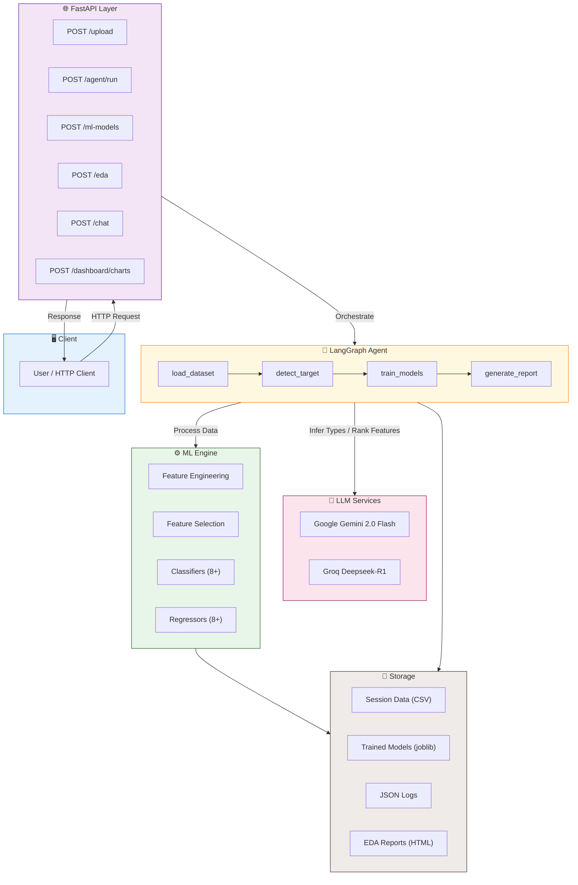
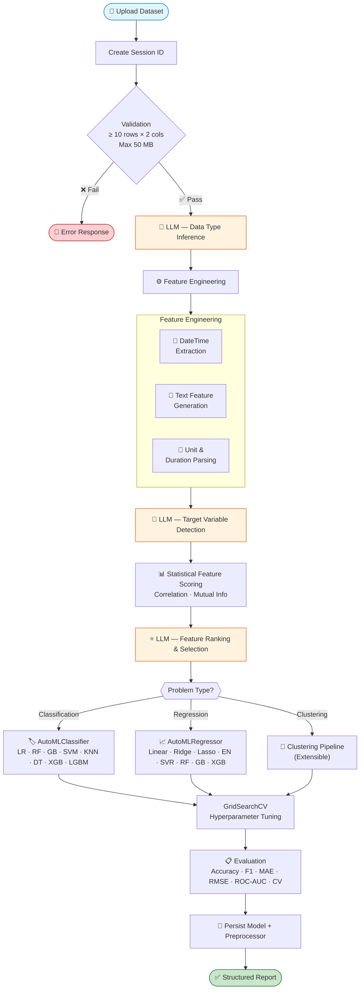
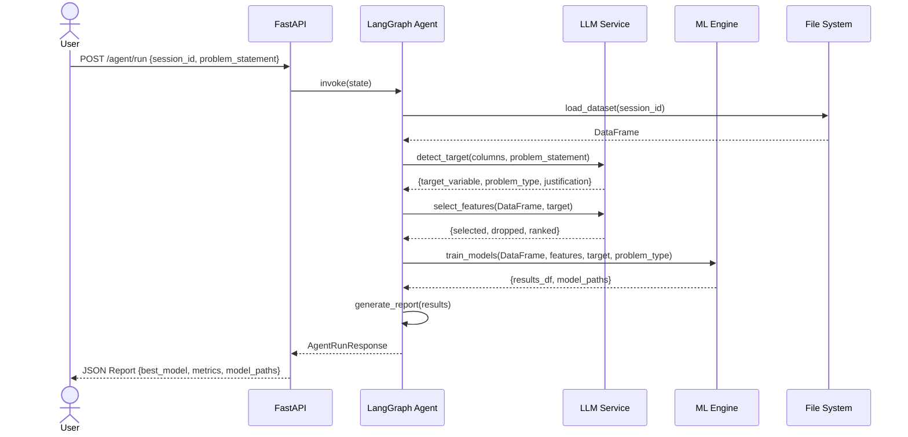

# AutoML — Automated Machine Learning Framework

<div align="center">

[](https://www.python.org/)
[](https://fastapi.tiangolo.com/)
[](https://www.langchain.com/)
[](https://langchain-ai.github.io/langgraph/)
[](https://scikit-learn.org/)
[](LICENSE)
[]()

<br/>

> **End-to-end ML automation powered by LLMs.** Upload a dataset, describe your goal, and AutoML handles everything — from intelligent feature engineering to multi-algorithm model training and interactive dashboards.

<br/>

[Overview](#-overview) &nbsp;•&nbsp; [Features](#-features) &nbsp;•&nbsp; [Quick Start](#-quick-start) &nbsp;•&nbsp; [Architecture](#-architecture) &nbsp;•&nbsp; [API Docs](#-api-reference) &nbsp;•&nbsp; [Contributing](#-contributing)

</div>

---

## 📋 Table of Contents

- [Overview](#-overview)
- [Features](#-features)
- [Quick Start](#-quick-start)
- [Installation](#-installation)
- [Architecture](#-architecture)
- [ML / LLM Pipeline](#-ml--llm-pipeline)
- [Project Structure](#-project-structure)
- [Usage](#-usage)
- [API Reference](#-api-reference)
- [Configuration](#-configuration)
- [Screenshots](#-screenshots)
- [Future Improvements](#-future-improvements)
- [Contributing](#-contributing)
- [License](#-license)

---

## 🔍 Overview

**AutoML** is a production-grade, AI-driven machine learning automation framework that eliminates the manual bottlenecks of data science workflows.

### Problem Statement

Building machine learning models from raw data is time-consuming and requires deep expertise in data cleaning, feature engineering, algorithm selection, and hyperparameter tuning. Teams waste days — or weeks — on repetitive preprocessing before any modelling even begins.

### Solution

AutoML integrates **LangGraph** orchestration, **LangChain** + **Google Gemini / Groq** LLMs, and a full **scikit-learn / XGBoost** model stack into a single RESTful service. Users upload a dataset, describe their objective in plain English, and receive trained models with comprehensive evaluation reports — all through a simple API.

| Aspect | Detail |
|---|---|
| **Architecture** | LangGraph Agentic ML Pipeline |
| **API** | FastAPI (async, REST) |
| **LLM Providers** | Google Gemini 2.0 Flash · Groq Deepseek-R1 |
| **ML Algorithms** | 12+ classifiers & regressors with GridSearchCV |
| **Deployment** | Local · Docker-ready |
| **Python** | 3.8+ |

---

## ✨ Features

### 🗄️ Data Processing
- **Smart Data Ingestion** — CSV / Excel uploads with automatic session management and validation
- **AI-Powered Type Analysis** — LLM infers and converts column data types (dates, units, booleans, numerics)
- **Advanced Feature Engineering**
  - DateTime decomposition (day, month, weekday, hour, minute)
  - LLM-driven semantic feature generation from text columns
  - Unit extraction: `"15 kg"` → `15.0`
  - Duration parsing: `"2h 30min"` → `150` (minutes)
  - Missing value handling and MinMax normalisation

### 🤖 Intelligent ML
- **Target Variable Detection** — LLM identifies the target column and problem type (classification / regression / clustering) from plain-English descriptions
- **Hybrid Feature Selection** — combines statistical analysis (correlation, mutual information) with LLM semantic ranking
- **Multi-Algorithm Training**
  - Classifiers: Logistic Regression, Random Forest, Gradient Boosting, SVM, KNN, Decision Tree, XGBoost, LightGBM
  - Regressors: Linear, Ridge, Lasso, ElasticNet, SVR, Random Forest, Gradient Boosting, XGBoost, LightGBM
  - Automated hyperparameter tuning via `GridSearchCV`
- **Comprehensive Metrics** — Accuracy / R², F1 / MAE, Precision / RMSE, Recall, ROC-AUC, cross-validation scores
- **Model Persistence** — trained models and preprocessing artefacts serialised with `joblib`

### 📊 Visualisation & Analysis
- **Interactive EDA Reports** — one-click HTML reports powered by `ydata-profiling`
- **Plotly Dashboards** — distribution, correlation, scatter, boxplot, and missing-value charts
- **Natural Language Q&A** — ask questions about your dataset; the LLM generates and executes safe pandas code

### 🏗️ Infrastructure
- **LangGraph Agent Pipeline** — stateful orchestration with conditional error routing
- **Structured JSON Logging** — `structlog` with timestamped log files
- **YAML Configuration** — swap LLM providers without code changes
- **Session Isolation** — each upload gets its own folder; up to 5 sessions retained automatically

---

## 🚀 Quick Start

```bash
# 1. Clone the repository
git clone https://github.com/Mayuresh-Bairagi/automl.git
cd automl

# 2. Create and activate a virtual environment
python -m venv venv
source venv/bin/activate          # Windows: venv\Scripts\activate

# 3. Install dependencies
pip install -r requirements.txt
pip install -e .

# 4. Configure API keys
cp .env.example .env
# Edit .env — add your GOOGLE_API_KEY and/or GROQ_API_KEY

# 5. Start the server
uvicorn app.main:app --reload --host 0.0.0.0 --port 8000
```

Then upload a dataset and run the full pipeline:

```bash
# Upload a CSV
curl -X POST "http://localhost:8000/upload" \
     -F "file=@my_dataset.csv"

# Run the full LangGraph agent pipeline
curl -X POST "http://localhost:8000/agent/run" \
     -H "Content-Type: application/json" \
     -d '{"session_id": "<session_id>", "problem_statement": "Predict customer churn"}'
```

---

## 📦 Installation

### Prerequisites

| Requirement | Version |
|---|---|
| Python | ≥ 3.8 |
| pip | latest |
| Google Generative AI API key | [Get key](https://aistudio.google.com/app/apikey) |
| Groq API key *(optional)* | [Get key](https://console.groq.com/) |

### Steps

```bash
# Clone
git clone https://github.com/Mayuresh-Bairagi/automl.git
cd automl

# Virtual environment (recommended)
python -m venv venv
source venv/bin/activate

# Install
pip install -r requirements.txt
pip install -e .

# Verify
python -c "import fastapi, pandas, sklearn, langchain; print('✅ All dependencies installed')"
```

---

## 🏗️ Architecture

### System Architecture



---

## 🔄 ML / LLM Pipeline

### End-to-End Data Flow



### LangGraph Agent — Sequence Diagram



---

## 📁 Project Structure

```
automl/
│
├── app/
│   └── main.py                        # FastAPI app — routes, CORS, startup
│
├── src/
│   ├── agent/
│   │   └── automl_agent.py            # LangGraph pipeline orchestration
│   │
│   ├── datasetAnalysis/
│   │   ├── data_ingestion.py          # Session-based CSV/Excel handling
│   │   └── data_type_analysis.py      # LLM-powered type inference & conversion
│   │
│   ├── dataCleaning/
│   │   └── featureEngineering01.py    # DateTime, text, unit & duration features
│   │
│   ├── problem_statement/
│   │   ├── target_variable.py         # LLM target detection & problem classification
│   │   └── AutoFeatureSelector.py     # Statistical + LLM feature ranking
│   │
│   ├── Classifier/
│   │   └── MLClassifier.py            # 8+ classifiers with GridSearchCV
│   │
│   ├── Regression/
│   │   └── regression.py              # 8+ regressors with GridSearchCV
│   │
│   ├── data_dashboard/
│   │   ├── eda.py                     # ydata-profiling HTML reports
│   │   └── interactive_dashboard.py   # Plotly interactive charts
│   │
│   └── data_qa/
│       └── dataset_qa.py              # NL Q&A — LLM generates pandas code
│
├── model/
│   └── models.py                      # Pydantic request/response schemas
│
├── utils/
│   ├── model_loader.py                # LLM client initialisation (Google / Groq)
│   └── config_loader.py               # YAML config parsing
│
├── logger/
│   └── customlogger.py                # structlog JSON logger
│
├── expection/
│   └── customExpection.py             # Custom exception with traceback detail
│
├── Propmt/
│   └── propmt_lib.py                  # Prompt template registry
│
├── config/
│   └── config.yml                     # LLM provider settings
│
├── data/
│   ├── Data_Train.csv                 # Sample training dataset
│   ├── weatherAUS.csv                 # Sample weather dataset
│   └── datasetAnalysis/               # Runtime session storage
│       └── {session_id}/
│           ├── raw_file.csv
│           ├── processed_file.csv
│           ├── models/
│           └── reports/
│
├── logs/                              # Timestamped JSON log files
├── requirements.txt
├── setup.py
├── .env.example
└── README.md
```

---

## 💻 Usage

### REST API — cURL Examples

```bash
# 1. Upload dataset
curl -X POST "http://localhost:8000/upload" \
     -F "file=@data/Data_Train.csv"
# → {"session_id": "session_id_20260322_193200_a1b2c3d4", "rows": 891, "columns": 12}

# 2. Generate EDA report
curl -X POST "http://localhost:8000/eda" \
     -H "Content-Type: application/json" \
     -d '{"session_id": "session_id_20260322_193200_a1b2c3d4"}'

# 3. Train ML models directly
curl -X POST "http://localhost:8000/ml-models" \
     -H "Content-Type: application/json" \
     -d '{"session_id": "session_id_...", "problem_statement": "Predict survival"}'

# 4. Run full LangGraph pipeline
curl -X POST "http://localhost:8000/agent/run" \
     -H "Content-Type: application/json" \
     -d '{"session_id": "session_id_...", "problem_statement": "Predict survival"}'

# 5. Ask a question about your data
curl -X POST "http://localhost:8000/chat" \
     -H "Content-Type: application/json" \
     -d '{"session_id": "session_id_...", "question": "What is the average age by survival status?"}'

# 6. Get interactive dashboard charts
curl -X POST "http://localhost:8000/dashboard/charts" \
     -H "Content-Type: application/json" \
     -d '{"session_id": "session_id_...", "chart_types": ["distribution", "correlation"]}'
```

### Python SDK Examples

```python
# ── Data Ingestion ──────────────────────────────────────────────────────────
from src.datasetAnalysis.data_ingestion import datasetHandler

handler = datasetHandler()
df, session_id = handler.save_dataset("data/Data_Train.csv")
print(f"Session: {session_id} | Shape: {df.shape}")

# ── Feature Engineering ─────────────────────────────────────────────────────
from src.dataCleaning.featureEngineering01 import FeatureEngineer1

fe = FeatureEngineer1(session_id=session_id)
processed_df = fe.generate_features()
# ✓ Datetime → day, month, weekday   ✓ "15 kg" → 15.0   ✓ "2h 30min" → 150

# ── Target Detection ────────────────────────────────────────────────────────
from src.problem_statement.target_variable import TargetVariable

tv = TargetVariable(session_id=session_id)
result, df = tv.get_target_variable("Predict whether a passenger survived")
print(result["target_variable"])   # "Survived"
print(result["problem_type"])      # "classification"

# ── Model Training ──────────────────────────────────────────────────────────
from src.Classifier.MLClassifier import AutoMLClassifier

clf = AutoMLClassifier(
    session_id=session_id,
    problem_statement="Predict passenger survival",
    result=result,
    df=df,
)
results_df, models, paths = clf.train_models()
print(results_df[["Model", "Accuracy", "F1_Score"]].to_string())
```

---

## 🔌 API Reference

### Endpoints

| Method | Endpoint | Description | Auth |
|---|---|---|---|
| `GET` | `/` | Health check | — |
| `POST` | `/upload` | Upload CSV / Excel dataset | — |
| `POST` | `/eda` | Generate ydata-profiling HTML report | — |
| `POST` | `/ml-models` | Train all ML models for a session | — |
| `POST` | `/agent/run` | Run full LangGraph agent pipeline | — |
| `POST` | `/chat` | Natural language Q&A over dataset | — |
| `POST` | `/dashboard/charts` | Generate Plotly chart specifications | — |

### Request / Response Schemas

#### `POST /upload`

```json
// Request: multipart/form-data
{ "file": "<binary CSV or Excel, max 50 MB>" }

// Response
{
  "status": "success",
  "session_id": "session_id_20260322_193200_a1b2c3d4",
  "rows": 891,
  "columns": 12,
  "preview": [{ "PassengerId": 1, "Survived": 0, "...": "..." }]
}
```

#### `POST /agent/run`

```json
// Request
{ "session_id": "session_id_...", "problem_statement": "Predict customer churn" }

// Response
{
  "status": "success",
  "problem_type": "classification",
  "target_variable": "Churn",
  "best_model": "RandomForest",
  "metrics": {
    "accuracy": 0.954,
    "f1_score": 0.941,
    "roc_auc": 0.978,
    "cv_mean": 0.947
  },
  "model_path": "data/datasetAnalysis/session_id_.../models/RandomForest.joblib",
  "all_results": [{ "model": "...", "accuracy": 0.0 }]
}
```

#### `POST /chat`

```json
// Request
{ "session_id": "session_id_...", "question": "What is the average age by survival?" }

// Response
{
  "answer": "Survived passengers averaged 28.3 years; non-survivors averaged 30.6 years.",
  "code": "df.groupby('Survived')['Age'].mean()",
  "error": null
}
```

#### `POST /dashboard/charts`

```json
// Request
{ "session_id": "session_id_...", "chart_types": ["distribution", "correlation", "boxplot"] }

// Response
{
  "charts": {
    "distribution": { "data": [...], "layout": {...} },
    "correlation":  { "data": [...], "layout": {...} },
    "boxplot":      { "data": [...], "layout": {...} }
  }
}
```

**Supported `chart_types`:** `distribution` · `correlation` · `scatter` · `bar` · `boxplot` · `missing_values`

---

## ⚙️ Configuration

### `.env` Example

```bash
# ── LLM Provider ────────────────────────────────────────
GOOGLE_API_KEY=your_google_api_key_here
GROQ_API_KEY=your_groq_api_key_here
LLM_PROVIDER=google          # "google" or "groq"

# ── Storage Paths (optional, defaults shown) ─────────────
DATA_STORAGE_PATH=./data/datasetAnalysis
LOGS_PATH=./logs
```

### `config/config.yml`

```yaml
llm:
  google:
    provider: "google"
    model_name: "gemini-2.0-flash"
    temperature: 0.0
    max_output_tokens: 2048

  groq:
    provider: "groq"
    model_name: "deepseek-r1-distill-llama-70b"
    temperature: 0.0
    max_output_tokens: 2048
```

### Path Reference

| Path | Purpose |
|---|---|
| `./data/datasetAnalysis/{session_id}/` | Per-session processed data and models |
| `./logs/` | Structured JSON application logs |
| `./config/config.yml` | LLM provider configuration |
| `./.env` | API keys and runtime environment |

---

## 🖼️ Screenshots

> _Screenshots will be added once the frontend UI is available._

| Screen | Preview |
|---|---|
| API Documentation (Swagger UI) | `http://localhost:8000/docs` |
| EDA Report | *(HTML report generated at runtime)* |
| Model Results Dashboard | *(Plotly charts via `/dashboard/charts`)* |

---

## 🔭 Future Improvements

- [ ] **Web UI** — React-based frontend for drag-and-drop uploads and results visualisation
- [ ] **Docker Compose** — containerised deployment with one command
- [ ] **Automated Model Deployment** — push trained models to a REST inference endpoint
- [ ] **Advanced HPO** — Optuna / Ray Tune integration for Bayesian hyperparameter search
- [ ] **More Data Formats** — Parquet, JSON, SQL database connections
- [ ] **Model Explainability** — SHAP / LIME integration for feature importance plots
- [ ] **Batch Prediction** — bulk inference endpoint for large datasets
- [ ] **Real-time Monitoring** — Prometheus metrics + Grafana dashboard
- [ ] **Clustering Algorithms** — K-Means, DBSCAN, hierarchical clustering pipeline
- [ ] **Automated Unit Tests** — pytest suite with fixtures and CI/CD integration

---

## 🤝 Contributing

Contributions are welcome! Please follow these steps:

1. **Fork** the repository
2. **Create** a feature branch
   ```bash
   git checkout -b feature/your-feature-name
   ```
3. **Commit** your changes with a descriptive message
   ```bash
   git commit -m "feat: add batch prediction endpoint"
   ```
4. **Push** to your fork and open a **Pull Request**

### Guidelines

- Follow [PEP 8](https://pep8.org/) style conventions
- Add docstrings to all public functions and classes
- Include tests for new functionality (place in a `tests/` directory)
- Keep commits atomic and PRs focused
- Update this README if your change affects usage or architecture
- Maintain backward compatibility unless a breaking change is necessary and documented

---

## 📝 License

This project is developed as part of an **Automated Machine Learning** research and educational initiative.

**Author:** Mayuresh Bairagi

---

<div align="center">

**[⬆ Back to Top](#automl--automated-machine-learning-framework)**

<br/>

Made with ❤️ for data science

</div>

