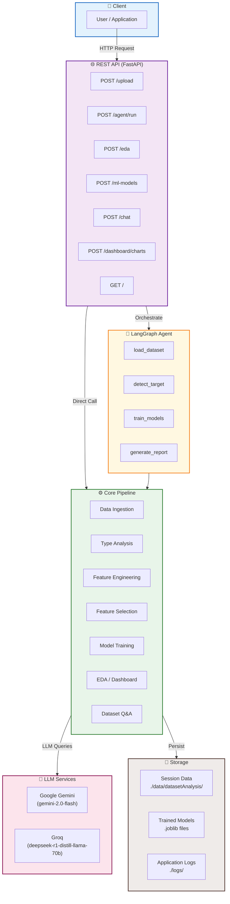
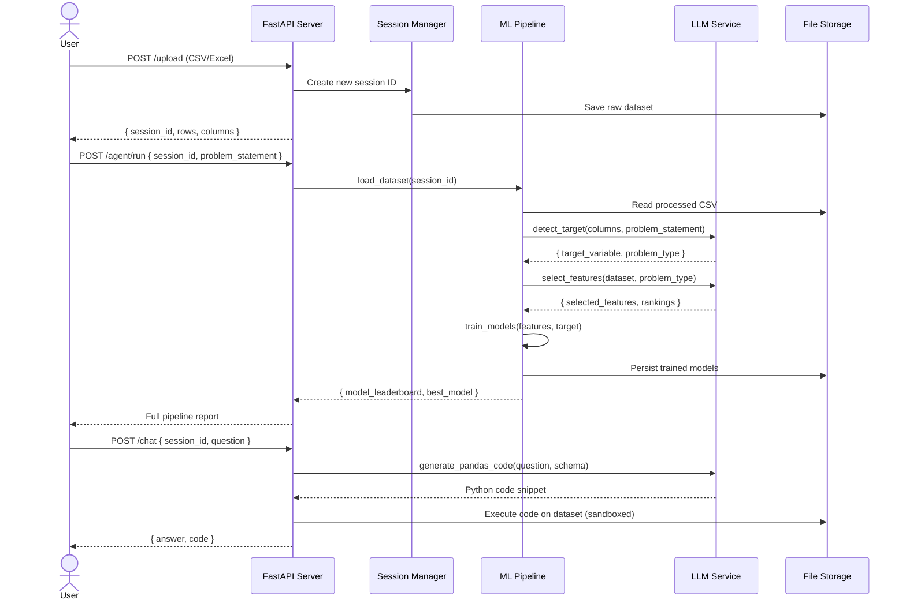
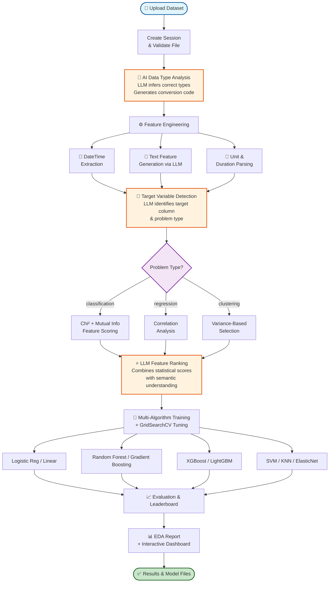
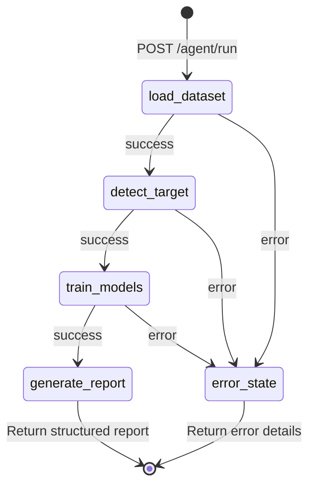

# AutoML — Automated Machine Learning Framework

<div align="center">

[](https://www.python.org/)
[](https://fastapi.tiangolo.com/)
[](https://langchain.com/)
[](https://scikit-learn.org/)
[](LICENSE)


<br/>

> **An AI-powered, end-to-end AutoML framework** that automates every stage of the machine learning pipeline — from data ingestion and feature engineering to model training, evaluation, and reporting — all orchestrated through a LangGraph agent and exposed via a clean REST API.

<br/>

[Features](#-features) &nbsp;•&nbsp; [Quick Start](#-quick-start) &nbsp;•&nbsp; [Architecture](#-architecture) &nbsp;•&nbsp; [API Reference](#-api-reference) &nbsp;•&nbsp; [Contributing](#-contributing)

</div>

---

## 📋 Table of Contents

- [Overview](#-overview)
- [Features](#-features)
- [Architecture](#-architecture)
- [ML / LLM Pipeline](#-ml--llm-pipeline)
- [Project Structure](#-project-structure)
- [Quick Start](#-quick-start)
- [Installation](#-installation)
- [Usage Guide](#-usage-guide)
- [API Reference](#-api-reference)
- [Configuration](#-configuration)
- [Screenshots](#-screenshots)
- [Future Improvements](#-future-improvements)
- [Contributing](#-contributing)
- [License](#-license)

---

## 🔍 Overview

### Problem Statement

Building machine learning models is a multi-step process that requires deep expertise in data cleaning, feature engineering, algorithm selection, and hyperparameter tuning. This process is time-consuming, error-prone, and demands significant manual effort.

### Solution

**AutoML** eliminates this complexity by providing an intelligent, fully automated pipeline that:

- 🤖 Uses **LLMs (Google Gemini / Groq)** to understand your data and make intelligent decisions at every pipeline stage
- ⚙️ Automates **feature engineering**, **type inference**, **target detection**, and **feature selection**
- 🚀 Trains and benchmarks **multiple ML algorithms** simultaneously with automated hyperparameter tuning
- 📊 Delivers **interactive EDA reports**, **dashboards**, and **model performance summaries**
- 💬 Lets you **ask questions about your data in plain English** via a conversational Q&A interface
- 🔗 Exposes everything through a **production-ready REST API**

---

## ✨ Features

### 🗄️ Data Processing
| Feature | Description |
|---|---|
| **Smart Data Ingestion** | CSV / Excel file upload with automatic session management |
| **AI Type Detection** | LLM-based inference of column data types with automatic conversion |
| **Datetime Engineering** | Extracts day, month, weekday, hour, and minute from date columns |
| **Text Feature Generation** | LLM-driven numeric feature extraction from free-text columns |
| **Unit Conversion** | Parses values like `"15 kg"` → `15.0` or `"2h 30min"` → `150` minutes |
| **Missing Value Handling** | Intelligent imputation and normalization |

### 🤖 AI & LLM
| Feature | Description |
|---|---|
| **Multi-LLM Support** | Switch between Google Gemini and Groq via a single config flag |
| **LangGraph Orchestration** | Stateful, conditional agent graph for full-pipeline automation |
| **Conversational Q&A** | Ask natural language questions about any loaded dataset |
| **Prompt Registry** | Centralized, version-controlled prompt templates for all LLM tasks |

### 📐 Machine Learning
| Feature | Description |
|---|---|
| **Target Variable Detection** | AI identifies the target column and classifies the problem type |
| **Feature Selection** | Statistical (chi², correlation, mutual info) + LLM-ranked feature selection |
| **Classification** | Logistic Regression, Random Forest, Gradient Boosting, SVM, KNN, Decision Tree, XGBoost, LightGBM |
| **Regression** | Linear, Ridge, Lasso, ElasticNet, SVR, Random Forest, Gradient Boosting, XGBoost, LightGBM |
| **Hyperparameter Tuning** | Automated GridSearchCV with cross-validation scoring |
| **Model Persistence** | Serializes and stores trained models per session |

### 📊 Reporting & Visualization
| Feature | Description |
|---|---|
| **Interactive EDA** | Full dataset profiling reports via `ydata-profiling` |
| **Plotly Dashboards** | Distribution, correlation, scatter, boxplot, and missing-value charts |
| **Model Leaderboard** | Side-by-side accuracy, F1, precision, recall, R², MAE, RMSE comparison |

### 🌐 API & Infrastructure
| Feature | Description |
|---|---|
| **FastAPI Backend** | Async REST API with CORS support and file-upload handling (50 MB max) |
| **Session Management** | Isolated, timestamped sessions keep multiple experiments independent |
| **Structured Logging** | JSON-formatted logs with automatic rotation and archiving |
| **Custom Exceptions** | Rich error context: file name, line number, and full traceback captured |

---

## 🏗️ Architecture

### System Architecture



### API Request Flow (Sequence Diagram)



---

## 🔬 ML / LLM Pipeline

### End-to-End Pipeline Flow



### LangGraph Agent State Machine



---

## 📁 Project Structure

```
automl/
├── app/
│   └── main.py                          # FastAPI app — routes, CORS, file handling
│
├── src/
│   ├── agent/
│   │   └── automl_agent.py              # LangGraph stateful orchestration agent
│   │
│   ├── datasetAnalysis/
│   │   ├── data_ingestion.py            # Session creation, file save/load, cleanup
│   │   └── data_type_analysis.py        # LLM-powered column type inference & conversion
│   │
│   ├── dataCleaning/
│   │   └── featureEngineering01.py      # Datetime, text, unit, duration feature extraction
│   │
│   ├── problem_statement/
│   │   ├── target_variable.py           # LLM target variable & problem-type detection
│   │   └── AutoFeatureSelector.py       # Statistical + LLM feature selection & ranking
│   │
│   ├── Classifier/
│   │   └── MLClassifier.py              # Multi-algorithm classification with GridSearchCV
│   │
│   ├── Regression/
│   │   └── regression.py                # Multi-algorithm regression with GridSearchCV
│   │
│   ├── data_qa/
│   │   └── dataset_qa.py                # Sandboxed NL Q&A over datasets via LLM
│   │
│   └── data_dashboard/
│       ├── eda.py                        # ydata-profiling HTML EDA report generation
│       └── interactive_dashboard.py      # Plotly interactive chart generation
│
├── model/
│   └── models.py                         # Pydantic request/response validation schemas
│
├── Propmt/
│   └── propmt_lib.py                     # Central prompt template registry (6 prompts)
│
├── utils/
│   ├── model_loader.py                   # LLM & embedding model initialization
│   └── config_loader.py                  # YAML config loader
│
├── logger/
│   └── customlogger.py                   # Structlog JSON logging + file rotation
│
├── expection/
│   └── customExpection.py                # Custom exception with traceback capture
│
├── config/
│   └── config.yml                        # LLM provider & model settings
│
├── data/
│   ├── Data_Train.csv                    # Sample training dataset
│   ├── weatherAUS.csv                    # Example dataset
│   └── datasetAnalysis/                  # Session-isolated processing outputs
│
├── logs/                                 # Rotating JSON application logs
│
├── requirements.txt                      # Python dependencies
├── setup.py                              # Package installation (v0.1.1)
├── .env.example                          # Environment variable template
└── README.md
```

---

## 🚀 Quick Start

```bash
# 1. Clone the repository
git clone https://github.com/Mayuresh-Bairagi/automl.git
cd automl

# 2. Create and activate a virtual environment
python -m venv venv
source venv/bin/activate          # Windows: venv\Scripts\activate

# 3. Install dependencies
pip install -r requirements.txt
pip install -e .

# 4. Configure environment variables
cp .env.example .env
# → Edit .env and add your API keys (see Configuration section)

# 5. Start the API server
uvicorn app.main:app --host 0.0.0.0 --port 8000 --reload

# 6. Upload a dataset and run the full pipeline
curl -X POST "http://localhost:8000/upload" \
     -F "file=@your_dataset.csv"

curl -X POST "http://localhost:8000/agent/run" \
     -H "Content-Type: application/json" \
     -d '{"session_id": "<returned_session_id>", "problem_statement": "Predict customer churn"}'
```

---

## 📦 Installation

### Prerequisites

| Requirement | Version |
|---|---|
| Python | 3.8+ |
| pip | latest |
| Google Generative AI API key | [Get one here](https://aistudio.google.com/) |
| Groq API key *(optional)* | [Get one here](https://console.groq.com/) |

### Step-by-Step

**1. Clone the repository**
```bash
git clone https://github.com/Mayuresh-Bairagi/automl.git
cd automl
```

**2. Create a virtual environment**
```bash
python -m venv venv
source venv/bin/activate    # Windows: venv\Scripts\activate
```

**3. Install all dependencies**
```bash
pip install -r requirements.txt
pip install -e .
```

**4. Set up environment variables**
```bash
cp .env.example .env
# Open .env and fill in your API keys
```

**5. Verify the installation**
```bash
python -c "import fastapi, pandas, sklearn, langchain; print('✓ All core dependencies installed')"
```

**6. Start the server**
```bash
uvicorn app.main:app --host 0.0.0.0 --port 8000
# API docs available at: http://localhost:8000/docs
```

---

## 📚 Usage Guide

### Data Ingestion

```python
from src.datasetAnalysis.data_ingestion import datasetHandler

handler = datasetHandler()
df, session_id = handler.save_dataset(uploaded_file)
print(f"Session: {session_id} | {len(df)} rows × {len(df.columns)} columns")
```

### AI Data Type Analysis

```python
from src.datasetAnalysis.data_type_analysis import DataTypeAnalyzer

analyzer = DataTypeAnalyzer("path/to/dataset.csv")
recommendations = analyzer.analyze_data_type()   # LLM inference
converted_df = analyzer.apply_conversions(df, recommendations)
```

### Automated Feature Engineering

```python
from src.dataCleaning.featureEngineering01 import FeatureEngineer1

fe = FeatureEngineer1("path/to/dataset.csv")
processed_df, session_id = fe.generate_features()
# Handles: datetime extraction, text→numeric, unit parsing, duration conversion
```

### Target Variable Detection

```python
from src.problem_statement.target_variable import TargetVariable

tv = TargetVariable(session_id="your_session_id")
result, df = tv.get_target_variable("Predict house prices")

print(f"Target : {result['target_variable']}")
print(f"Type   : {result['problem_type']}")   # regression | classification | clustering
print(f"Reason : {result['justification']}")
```

### Feature Selection

```python
from src.problem_statement.AutoFeatureSelector import FeatureSelector

selector = FeatureSelector(session_id, "Predict customer churn")
response = selector.llm_response()

print("Selected :", response['selected_features'])
print("Dropped  :", response['dropped_features'])
print("Rankings :", response['ranked_features'])
```

### Classification Training

```python
from src.Classifier.MLClassifier import AutoMLClassifier

clf = AutoMLClassifier(
    session_id="your_session_id",
    problem_statement="Customer churn prediction",
    result=target_result,
    df=dataframe
)
results_df, trained_models, model_paths = clf.train_models()
print(results_df[["Model", "Accuracy", "F1_Score", "Best_Params"]])
```

### Regression Training

```python
from src.Regression.regression import AutoMLRegressor

reg = AutoMLRegressor(
    session_id="your_session_id",
    problem_statement="Predict house price",
    result=target_result,
    df=dataframe
)
results_df, trained_models, model_paths = reg.train_models()
print(results_df[["Model", "R2_Score", "MAE", "RMSE"]])
```

### Natural Language Q&A

```python
from src.data_qa.dataset_qa import DatasetQA

qa = DatasetQA(session_id="your_session_id")
answer = qa.answer_question("What is the average age of customers who churned?")
print(answer["result"])
print(answer["code"])   # Generated pandas code
```

### EDA Report

```python
from src.data_dashboard.eda import EDA

eda = EDA(session_id="your_session_id")
html_path = eda.generate_report()
# Opens a full ydata-profiling HTML report
```

---

## 🔌 API Reference

Base URL: `http://localhost:8000`  
Interactive docs: `http://localhost:8000/docs`

| Method | Endpoint | Description | Key Body / Params |
|---|---|---|---|
| `GET` | `/` | Health check | — |
| `POST` | `/upload` | Upload CSV / Excel dataset | `file` (multipart) |
| `POST` | `/eda` | Generate interactive EDA HTML report | `session_id` |
| `POST` | `/ml-models` | Train classification or regression models | `session_id`, `problem_statement` |
| `POST` | `/agent/run` | Run full LangGraph pipeline (end-to-end) | `session_id`, `problem_statement` |
| `POST` | `/chat` | Natural language Q&A over a dataset | `session_id`, `question` |
| `POST` | `/dashboard/charts` | Generate Plotly interactive charts | `session_id`, `chart_types` |

### Example: Upload Dataset

```bash
curl -X POST "http://localhost:8000/upload" \
     -H "Content-Type: multipart/form-data" \
     -F "file=@data.csv"
```

```json
{
  "status": "success",
  "session_id": "session_id_20260322_192000_abc12345",
  "rows": 1000,
  "columns": 25,
  "file_path": "./data/datasetAnalysis/session_id_.../engineered_data.csv"
}
```

### Example: Run Full Pipeline

```bash
curl -X POST "http://localhost:8000/agent/run" \
     -H "Content-Type: application/json" \
     -d '{"session_id": "session_id_20260322_192000_abc12345", "problem_statement": "Predict customer churn"}'
```

```json
{
  "status": "success",
  "target_variable": "Churn",
  "problem_type": "classification",
  "selected_features": ["tenure", "MonthlyCharges", "Contract"],
  "model_leaderboard": [
    { "Model": "XGBoost",      "Accuracy": 0.95, "F1_Score": 0.94 },
    { "Model": "RandomForest", "Accuracy": 0.93, "F1_Score": 0.92 }
  ],
  "best_model_path": "./data/datasetAnalysis/.../XGBoost.joblib"
}
```

### Example: Chat with Your Data

```bash
curl -X POST "http://localhost:8000/chat" \
     -H "Content-Type: application/json" \
     -d '{"session_id": "session_id_...", "question": "What is the average monthly charge for churned customers?"}'
```

```json
{
  "answer": "The average monthly charge for churned customers is $74.44",
  "code": "df[df['Churn']==1]['MonthlyCharges'].mean()"
}
```

---

## ⚙️ Configuration

### Environment Variables

Create a `.env` file in the project root (copy from `.env.example`):

```dotenv
# ─── LLM Provider ──────────────────────────────────────────────
GOOGLE_API_KEY=your_google_generative_ai_key_here
GROQ_API_KEY=your_groq_api_key_here
LLM_PROVIDER=google          # 'google' or 'groq'

# ─── Storage Paths ─────────────────────────────────────────────
DATA_STORAGE_PATH=./data/datasetAnalysis
LOGS_PATH=./logs
```

### LLM Configuration (`config/config.yml`)

```yaml
llm:
  google:
    provider: "google"
    model_name: "gemini-2.0-flash"
    temperature: 0.0
    max_output_tokens: 2048

  groq:
    provider: "groq"
    model_name: "deepseek-r1-distill-llama-70b"
    temperature: 0.0
    max_output_tokens: 2048
```

### Configuration Reference

| Variable | Default | Description |
|---|---|---|
| `LLM_PROVIDER` | `google` | Active LLM backend (`google` or `groq`) |
| `GOOGLE_API_KEY` | — | Google Generative AI API key |
| `GROQ_API_KEY` | — | Groq API key |
| `DATA_STORAGE_PATH` | `./data/datasetAnalysis` | Directory for session data |
| `LOGS_PATH` | `./logs` | Directory for application logs |

---

## 🖼️ Screenshots

> **Note:** The paths below are placeholders. Replace them with real screenshots once the application is running (e.g., save them under `docs/screenshots/`).

| View | Preview |
|---|---|
| FastAPI Interactive Docs (`/docs`) |  |
| EDA Report (ydata-profiling) |  |
| Interactive Dashboard (Plotly) |  |
| Model Leaderboard Response |  |

---

## 🔮 Future Improvements

- [ ] **Web UI** — React/Streamlit frontend for no-code model building
- [ ] **Model Deployment** — One-click export to Docker / FastAPI endpoint
- [ ] **Real-Time Monitoring** — Live model performance and data drift tracking
- [ ] **Advanced HPO** — Optuna / Ray Tune integration for better hyperparameter search
- [ ] **Additional Data Formats** — Parquet, JSON, and database connector support
- [ ] **Model Explainability** — SHAP and LIME integration for interpretability
- [ ] **Batch Inference** — Support for large-scale offline prediction jobs
- [ ] **Clustering Pipeline** — Full unsupervised learning workflow
- [ ] **CI/CD Pipeline** — Automated testing and deployment workflows
- [ ] **Multi-User Support** — Authentication and per-user session isolation

---

## 🤝 Contributing

Contributions are welcome! Please follow these steps:

1. **Fork** the repository
2. **Create** a feature branch
   ```bash
   git checkout -b feature/your-feature-name
   ```
3. **Commit** your changes with a clear message
   ```bash
   git commit -m "feat: add your feature description"
   ```
4. **Push** to your fork
   ```bash
   git push origin feature/your-feature-name
   ```
5. **Open** a Pull Request against `main`

### Guidelines

- Follow **PEP 8** style conventions
- Add **docstrings** to all public functions and classes
- Include **unit tests** for new features where possible
- Keep **backward compatibility** in mind
- Update the README if you add or change functionality

---

## 📝 License

This project is licensed under the **MIT License** — see the [LICENSE](LICENSE) file for details.

---

## 👤 Author

**Mayuresh Bairagi**

---

## 🆘 Support

| Channel | Details |
|---|---|
| **Bug Reports** | Open a [GitHub Issue](https://github.com/Mayuresh-Bairagi/automl/issues) with steps to reproduce, error logs, and expected behaviour |
| **Logs** | Check `./logs/` for structured JSON logs with timestamps and full tracebacks |
| **API Docs** | Visit `http://localhost:8000/docs` for the interactive Swagger UI |

---

<div align="center">

**[⬆ Back to Top](#automl--automated-machine-learning-framework)**

<br/>

Made with ❤️ for the data science community

</div>

