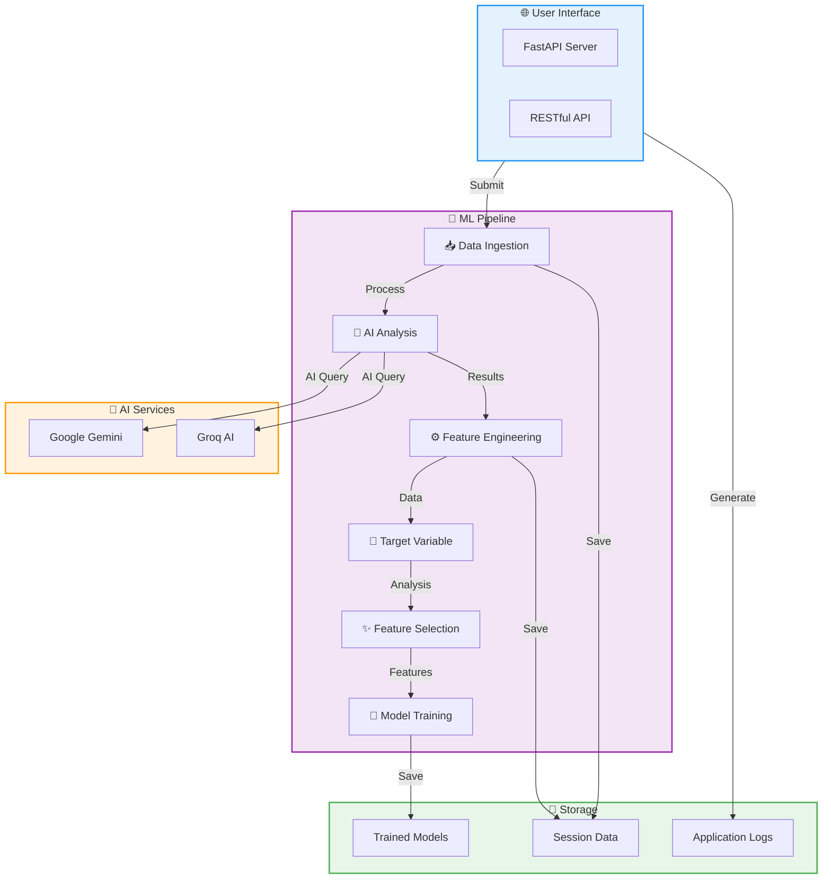
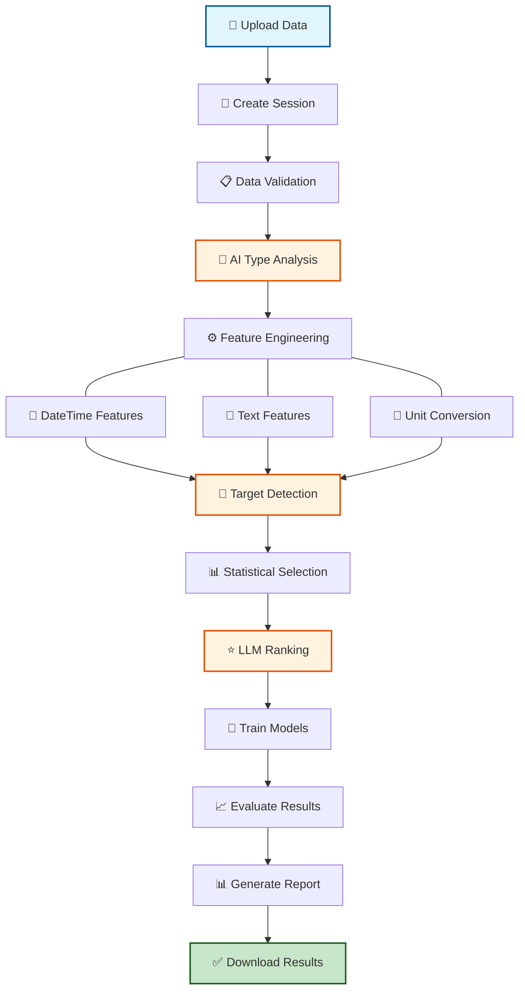

# AutoML: Automated Machine Learning Framework

<div align="center">


An intelligent **Automated Machine Learning (AutoML)** framework that streamlines end-to-end machine learning workflows. From data ingestion to model deployment, AutoML handles feature engineering, data analysis, and predictive modeling—all powered by cutting-edge AI services.

[Features](#-features) • [Quick Start](#-quick-start) • [Installation](#-installation) • [Documentation](#-documentation) • [Contributing](#-contributing)

</div>

---

## 📋 Table of Contents

- [Overview](#overview)
- [Features](#-features)
- [Quick Start](#-quick-start)
- [Installation](#-installation)
- [Architecture](#-architecture)
- [Project Structure](#-project-structure)
- [Usage Guide](#-usage-guide)
- [Configuration](#-configuration)
- [API Reference](#-api-reference)
- [Contributing](#-contributing)
- [Author](#-author)

---

## Overview

AutoML is a comprehensive machine learning automation framework designed to reduce the complexity of building, training, and deploying predictive models. By leveraging AI-powered data analysis and intelligent feature engineering, AutoML enables data scientists and analysts to build high-quality models with minimal manual effort.

**Key Capabilities:**
- 🤖 AI-powered data type detection and conversion
- 🔧 Automated feature engineering with temporal and text processing
- 🎯 Intelligent target variable identification
- 📊 Advanced feature selection and ranking
- 🚀 Multi-algorithm model training with hyperparameter tuning
- 📈 Interactive EDA reports and visualizations
- 🌐 RESTful API with FastAPI for seamless integration

---

## ✨ Features

### Data Processing & Analysis
- **Intelligent Data Ingestion**: Automated CSV/Excel file handling with session management
- **AI-Powered Data Type Analysis**: LLM-based intelligent data type inference and conversion
- **Advanced Feature Engineering**: 
  - Automated datetime feature extraction (day, month, weekday, hour, minute)
  - LLM-driven text feature generation from object columns
  - Unit conversion and duration processing
  - Missing value handling and data normalization
- **Comprehensive Data Analysis**: Automated EDA with interactive HTML reports

### Machine Learning & Model Management
- **Target Variable Detection**: AI-powered identification of target variables and problem types
- **Intelligent Feature Selection**: Statistical and LLM-based feature ranking and selection
- **Automated ML Classification**: 
  - Multiple algorithms: Logistic Regression, Random Forest, Gradient Boosting, SVM, KNN, Decision Trees
  - Automatic hyperparameter tuning with GridSearchCV
  - Data preprocessing with label encoding and MinMax scaling
  - Comprehensive performance metrics
- **Model Persistence**: Automatic model serialization and loading

### AI & Automation
- **Multi-LLM Support**: Integration with Google Gemini and Groq for intelligent analysis
- **LangChain Framework**: Leverage advanced language model capabilities
- **Smart Prompting**: Pre-configured prompt templates for various analysis tasks

### Application & Logging
- **FastAPI Web Application**: RESTful API with CORS support for easy integration
- **Structured Logging**: JSON-formatted logs with dual file/console output
- **Custom Exception Handling**: Detailed error tracking and debugging information
- **Configuration Management**: YAML-based configuration for easy customization

---

## 🚀 Quick Start

### 1. Install Dependencies
```bash
git clone <repository-url>
cd automl
pip install -r requirements.txt
pip install -e .
```

### 2. Set Up Environment
```bash
# Create .env file
echo "GOOGLE_API_KEY=your_key_here" > .env
echo "GROQ_API_KEY=your_key_here" >> .env
echo "LLM_PROVIDER=google" >> .env
```

### 3. Start the Server
```bash
python app/main.py
# or
uvicorn app.main:app --host 0.0.0.0 --port 8000
```

### 4. Upload and Process Data
```bash
curl -X POST "http://localhost:8000/upload" \
     -H "Content-Type: multipart/form-data" \
     -F "file=@your_dataset.csv"
```

---

## 📦 Installation

### Prerequisites
- Python 3.8 or higher
- pip package manager
- API keys for Google Generative AI and/or Groq

### Step-by-Step Installation

1. **Clone and Setup**
```bash
git clone <repository-url>
cd automl
python -m venv venv
source venv/bin/activate  # On Windows: venv\Scripts\activate
```

2. **Install Dependencies**
```bash
pip install -r requirements.txt
pip install -e .
```

3. **Configure Environment**
```bash
# Copy environment template
cp .env.example .env

# Edit .env with your API keys
GOOGLE_API_KEY=your_google_api_key
GROQ_API_KEY=your_groq_api_key
LLM_PROVIDER=google  # or 'groq'
```

4. **Verify Installation**
```bash
python -c "import fastapi, pandas, sklearn; print('✓ All dependencies installed')"
```

---

## 🏗️ Architecture

### System Architecture Flow



### ML Processing Workflow



---

## 📁 Project Structure

```
automl/
├── app/
│   └── main.py                         # FastAPI application entry point
│
├── src/
│   ├── datasetAnalysis/
│   │   ├── data_ingestion.py          # CSV/Excel file processing & session management
│   │   └── data_type_analysis.py      # AI-powered data type inference & conversion
│   │
│   ├── dataCleaning/
│   │   └── featureEngineering01.py    # Automated feature extraction & transformation
│   │
│   ├── problem_statement/
│   │   ├── target_variable.py         # AI target variable detection & classification
│   │   └── AutoFeatureSelector.py     # Intelligent feature selection & ranking
│   │
│   ├── Classifier/
│   │   └── MLClassifier.py            # Multi-algorithm ML training & tuning
│   │
│   └── data_dashboard/
│       └── eda.py                     # Automated EDA & HTML report generation
│
├── model/
│   └── models.py                      # Pydantic data validation models
│
├── utils/
│   ├── model_loader.py                # LLM & embedding model initialization
│   └── config_loader.py               # YAML configuration management
│
├── logger/
│   └── customlogger.py                # Structured JSON logging
│
├── expection/
│   └── customExpection.py             # Custom exception handling & tracking
│
├── config/
│   └── config.yml                     # LLM provider configuration
│
├── data/
│   ├── Data_Train.csv                 # Training dataset
│   └── datasetAnalysis/               # Session-based processing outputs
│
├── logs/                              # Application logs
│
├── requirements.txt                   # Python dependencies
├── setup.py                          # Package installation configuration
├── .env.example                      # Environment variables template
└── README.md                         # This file
```

---

## 📚 Usage Guide

### Data Ingestion & Processing

```python
from src.datasetAnalysis.data_ingestion import datasetHandler

# Initialize handler
handler = datasetHandler()

# Load CSV/Excel file
df = handler.save_dataset(uploaded_file)
print(f"Loaded {len(df)} rows, {len(df.columns)} columns")
```

### AI-Powered Data Type Analysis

```python
from src.datasetAnalysis.data_type_analysis import DataTypeAnalyzer

analyzer = DataTypeAnalyzer("path/to/dataset.csv")

# Get AI recommendations
recommendations = analyzer.analyze_data_type()

# Apply conversions
converted_df = analyzer.apply_conversions(df, recommendations)
```

### Automated Feature Engineering

```python
from src.dataCleaning.featureEngineering01 import FeatureEngineer1

fe = FeatureEngineer1("path/to/dataset.csv")

# Auto-generate features
processed_df, session_id = fe.generate_features()

# Automatically handles:
# ✓ Datetime → day, month, weekday, hour, minute
# ✓ Text columns → LLM-generated features
# ✓ Units → Numeric extraction ("15 kg" → 15.0)
# ✓ Durations → Conversion ("2h 30min" → 150 minutes)
```

### Target Variable Detection

```python
from src.problem_statement.target_variable import TargetVariable

target_handler = TargetVariable(session_id="your_session_id")

# AI-powered detection
result, df = target_handler.get_target_variable("Predict house prices")

print(f"🎯 Target Variable: {result['target_variable']}")
print(f"📊 Problem Type: {result['problem_type']}")  # regression/classification/clustering
print(f"📝 Reasoning: {result['justification']}")
```

### Intelligent Feature Selection

```python
from src.problem_statement.AutoFeatureSelector import FeatureSelector

selector = FeatureSelector(session_id, "Predict customer churn")

# Statistical + LLM-based selection
response = selector.llm_response()

print(f"✨ Selected: {response['selected_features']}")
print(f"❌ Removed: {response['dropped_features']}")
print(f"⭐ Rankings: {response['ranked_features']}")
```

### Automated Model Training

```python
from src.Classifier.MLClassifier import AutoMLClassifier

classifier = AutoMLClassifier(
    session_id="your_session_id",
    problem_statement="Customer churn prediction",
    result=target_result,
    df=dataframe
)

# Train all models with hyperparameter optimization
results_df, trained_models, model_paths = classifier.train_models()

# View performance comparison
print(results_df)
#            Model  Accuracy  F1_Score              Best_Params
# 0  RandomForest     0.95      0.94  {'n_estimators': 100}
# 1    LogisticRegression  0.92    0.91  {'C': 1}
```

### Exploratory Data Analysis

```python
from src.data_dashboard.eda import EDA

# Generate interactive HTML report
eda = EDA(session_id="your_session_id")
html_path = eda.generate_report()

# Includes:
# 📊 Dataset statistics & profiling
# 📈 Distribution plots & correlations
# ❌ Missing values analysis
# 🎯 Data quality insights
```

---

## ⚙️ Configuration

### Environment Variables (.env)

```bash
# LLM Configuration
GOOGLE_API_KEY=your_google_api_key_here
GROQ_API_KEY=your_groq_api_key_here
LLM_PROVIDER=google              # 'google' or 'groq'

# Data Configuration
DATA_STORAGE_PATH=./data/datasetAnalysis
LOGS_PATH=./logs
```

### LLM Settings (config/config.yml)

```yaml
llm:
  google:
    provider: "google"
    model_name: "gemini-2.0-flash"
    temperature: 0.0
    max_output_tokens: 2048
  
  groq:
    provider: "groq"
    model_name: "deepseek-r1-distill-llama-70b"
    temperature: 0.0
    max_output_tokens: 2048
```

### Application Paths

| Path | Purpose |
|------|---------|
| `./data/datasetAnalysis/` | Session data storage |
| `./logs/` | Application logs |
| `./config/config.yml` | LLM configuration |

---

## 🔌 API Reference

### File Upload Endpoint

**POST** `/upload`

Upload a CSV or Excel file for processing

```bash
curl -X POST "http://localhost:8000/upload" \
     -H "Content-Type: multipart/form-data" \
     -F "file=@data.csv"
```

**Response:**
```json
{
  "status": "success",
  "session_id": "session_id_20260306_120000_abc123",
  "rows": 1000,
  "columns": 25,
  "file_path": "path/to/processed/file"
}
```

### Status Endpoint

**GET** `/status/{session_id}`

Get processing status for a session

```bash
curl "http://localhost:8000/status/session_id_20260306_120000_abc123"
```

---

## 🧠 Key Components

### Core Modules

| Module | Purpose | Key Features |
|--------|---------|--------------|
| **data_ingestion.py** | File processing | Session management, validation |
| **data_type_analysis.py** | Data type detection | AI inference, type conversion |
| **featureEngineering01.py** | Feature creation | Datetime, text, unit processing |
| **target_variable.py** | Target detection | Problem classification, AI analysis |
| **AutoFeatureSelector.py** | Feature selection | Correlation, mutual info, ranking |
| **MLClassifier.py** | Model training | Multi-algorithm, hyperparameter tuning |
| **eda.py** | Data analysis | Interactive reports, visualizations |

### Utility Classes

```python
from logger.customlogger import CustomLogger
from expection.customExpection import AutoML_Exception
from utils.config_loader import ConfigLoader
from utils.model_loader import ModelLoader

# Structured logging
logger = CustomLogger().get_logger('MyModule')
logger.info("Processing started", user_id=123, filename="data.csv")

# Exception handling
try:
    # Your code
    pass
except Exception as e:
    raise AutoML_Exception("Custom error message", e)
```

---

## 🛠️ Development

### Running Tests

```bash
# Test data ingestion
python src/datasetAnalysis/data_ingestion.py

# Test data type analysis
python src/datasetAnalysis/data_type_analysis.py

# Test feature engineering
python src/dataCleaning/featureEngineering01.py

# Test ML pipeline
python src/Classifier/MLClassifier.py

# Test EDA
python src/data_dashboard/eda.py
```

### Running the Application

```bash
# Development server with auto-reload
uvicorn app.main:app --reload --host 0.0.0.0 --port 8000

# Production server
python app/main.py
```

---

## 📋 Dependencies

**Core Framework:**
- FastAPI & Uvicorn - Web framework & ASGI server
- Pandas & NumPy - Data manipulation & numerical computing

**Machine Learning:**
- Scikit-learn - ML algorithms & preprocessing
- XGBoost, LightGBM, CatBoost - Advanced gradient boosting

**Data Visualization & Analysis:**
- Matplotlib, Seaborn, Plotly - Data visualization
- Pydantic - Data validation

**AI & LLM:**
- LangChain - LLM orchestration framework
- Google Generative AI - Google's Gemini models
- Groq - High-speed LLM inference

**Utilities:**
- Structlog - Structured JSON logging
- PyYAML - Configuration parsing
- Joblib - Model serialization

See `requirements.txt` for complete list with versions.

---

## 🤝 Contributing

We welcome contributions! Here's how to get started:

1. Fork the repository
2. Create a feature branch: `git checkout -b feature/amazing-feature`
3. Make your changes and commit: `git commit -m 'Add amazing feature'`
4. Push to branch: `git push origin feature/amazing-feature`
5. Open a Pull Request

### Contribution Guidelines
- Follow PEP 8 style guide
- Add docstrings to all functions
- Include unit tests for new features
- Update README with new features
- Maintain backward compatibility

---

## 📝 License

This project is part of a **College Project** for Automated Machine Learning research and development.

---

## 👤 Author

**Mayuresh Bairagi**

---

## 📞 Support & Issues

For issues, bugs, or questions:

1. Check the [logs directory](./logs/) for detailed error information
2. Review the documentation in relevant modules
3. Check existing GitHub issues
4. Create a new issue with:
   - Clear description
   - Steps to reproduce
   - Error logs
   - Expected behavior

---

## 🎯 Roadmap

- [ ] Web UI for model management
- [ ] Automated model deployment
- [ ] Real-time monitoring & logging
- [ ] Advanced hyperparameter optimization
- [ ] Support for more data formats (Parquet, JSON)
- [ ] Model explainability (SHAP, LIME)
- [ ] Batch processing capabilities

---

<div align="center">

**[⬆ back to top](#automl-automated-machine-learning-framework)**

Made with ❤️ for data science

</div>


